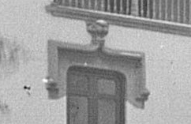
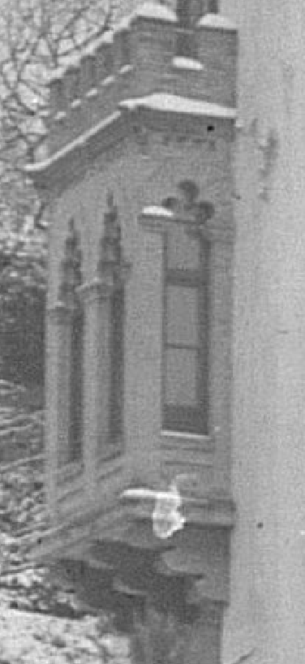

## Introducción

Los comienzos del siglo XX en Granada se caracterizaron, en lo económico, por la gran expansión económica debida sobre todo al cultivo de la caña de azúcar y la implantación de la industria azucarera e infraestructura eléctrica y de transporte relacionada con la misma [@granadaXX] y en lo político por el *lachiquismo* [@osuna2015protesta], caciquismo organizado y dirigido desde Juan Ramón Lachica Mingo, enriquecido precisamente con el cultivo del azúcar y perteneciente (nominalmente) al partido liberal.

En lo primero debemos enmarcar la llegada a Granada de Nicolás de Escoriaza y Fabro [@escoriaza], que en 1903 funda los Tranvías Eléctricos de Granada [@martinez2000gregorio] que comienzan a funcionar el año siguiente. Escoriaza, nombrado vizconde en 1919 (de donde sale el nombre de "Palacio del Vizconde" que también tiene este edificio) tiene negocios con diferentes empresas belgas y suizas, y por ello lo nombran comisario del pabellón español de la exposición universal de Bruselas en 1910.

En lo segundo podemos enmarcar la presencia de Modesto Cendoya [@Cendoya]. Tras ser destituido como arquitecto provincial por su negligencia en la reconstrucción tras el terremoto de Alhama, es nombrado arquitecto conservador de la Alhambra en 1907, posiblemente en el marco del lachiquismo [@lopera1977decision], puesto que ocuparía hasta su cese en 1923. Desde 1901 desarrolló su labor en Granada y a él se deben el Hotel Alhambra Palace y la Azucarera San Isidro. En 1910 se le encargó una copia del patio de los leones para el pabellón de España en la exposición de Bruselas, que comisariaba Nicolás de Escoriaza, posiblemente por él mismo.

Previamente, en 1905, se le había encargado el proyecto de este palacete [@iaph]. Como muchas de las otras obras de Cendoya, sigue el estilo regionalista/historicista, con elementos en este caso nazaríes y mudéjares. La vivienda ha sufrido diferentes reformas, la última de ellas en 1989. Es privada y no se puede visitar; se menciona que son apartamentos turísticos, pero no he encontrado ninguna referencia en ninguna plataforma de ese tipo, así que no podemos saber con exactitud el interior como está decorado ni tomar una foto de detalle desde más cerca. Es un edificio catalogado en el Instituto Andaluz de Patrimonio Histórico como parte de la denominación "Conjunto de palacetes del Paseo de la Bomba" [@iaph], pero no consta ningún tipo de protección.

## Vocabulario arquitectónico

La casa presenta un aspecto general de palacio o vivienda con varios cuerpos, cinco aparentemente desde la vista satélite de Google maps, con jardines alrededor y un torreón almenado en una de las esquinas. La fachada principal se abrehacia la cuesta Escoriaza (nombrada por el propietario inicial del inmueble), y la fachada de entrada real se abre al Paseo de la Bomba con el número 8. Tiene tres pisos, bajo y semisótano, aunque desde esta imagen sólo se pueden apreciar los tres pisos. 

La esquina de la torre, hasta la altura de la tercera planta, está *achaflanada* con una función, una vez más, más estética que defensiva.

### 1: Ménsulas o canecillos de bocel escalonado

Se trata de ménsulas exentas, usadas como puro elemento decorativo. En la torre que hay al final de la avenida Cervantes, del mismo arquitecto, se usan de la misma forma. Como bien se indica en [@andaltura], ambos recuerdan a la Torre de los Picos de la Alhambra, tanto en el aspecto general como en el caso de estas ménsulas. En esta última sólo aparecen en uno de los lados, y además es posible que tuvieran una función original de sostén de alguna plataforma defensiva de madera, o quizás una *garita* o *ladronera* eliminadas de la Torre de los Picos al perder su función defensiva.

### 2: Almenas

Una vez más, se trata de una copia de la Torre de los Picos, también replicada en la indicada torre de la avenida Cervantes. Tiene merlones terminados en albardilla a cuatro aguas.

### 3. Aleros de madera

Formando quizá parte de un artesonado en el interior, este alero de madera es una vez más similar al de la fachada de Comares; en ese caso pretende dar sombra, en este caso parece puramente decorativa.

### 4: Escudo

El escudo tiene un yelmo, lo que correspondería a algún tipo de hidalguía. Y aunque no está muy claro, presenta una torre centrada. Dado que tras su construcción fue adquirido por la familia Moreno Agrela (también propietaria del palacio de los patos), duques de Agrela, es posible que sea el escudo de la familia Moreno, "una torre de gules en campo de oro, con dos águilas de sable volantes" [@moreno].

Este es uno de los elementos que ha cambiado desde esta foto sin fecha encontrada en Twitter, extraída del archivo municipal [@vistas:granada] y tomada en 1911 durante una nevada. Como se ve, el escudo, muy posiblemente el original puesto que estaba recién construida, es mucho más historiado, aunque tampoco lleva una corona de vizconde y no se ve con suficiente claridad para afirmar que sea de los Escoriaza.

### 5: Ventanas con celosía

Son ventanas simples en arco de medio punto, pero con unas celosías que recuerdan, en este caso, al Alcázar Genil. Estas ventanas se repiten en la otra parte visible de la torre.

### 6: Columna con capitel nazarí

Esta columna actúa como parteluz del ventanal que veremos a continuación, con el número 7. Usa un capitel nazarí, compuesto por un baquetón, collarín decorado con hojas de palmera y ábaco cuadrado, aparentemente decorado con motivos vegetales. En este caso no tiene basa, y se apoya sobre una balaustrada decorada, aparentemente, con ladrillos exentos y encalados. No hemos encontrado ningún tipo de referencia a este tipo de elemento constructivo, aunque podría ser modernista.

### 7: Ventanal partido con arcos peraltados

Continuamos el muestrario de ventanas, comenzando con estas situadas en el torreón. Se trata de arcos de medio punto peraltados, una vez más muy comunes en el arte nazarí, y presentes en la Alhambra. Aunque no se aprecia con este nivel de ampliación, se trata de arcos *festoneados*, tanto el intradós como la (única) *arquivolta* que hay en el exterior. Aunque no tiene un alfiz marcado en este caso, las *albanegas* están decoradas con motivos vegetales, una vez más igual que en la Alhambra y otros edificios nazaríes o musulmanes. No es posible saber el material que usan, pero podría tratarse de yeserías, igual que en la Alhambra, aunque también podría ser escayola. La terminación del arco es en modillones *de rollo*, que le dan a la ventana un aspecto acampanado, una vez más, como en otras construcciones hispano-musulmanas.

### 8: Panel epigráfico de yeserías

Aparentemente con la misma inscripción que se encuentra en la Alhambra, "Sólo Alá es vencedor". La posición del panel es similar a la de arcos en la Alhambra con puertas adinteladas a los lados; sin embargo aquí, una vez más, se emplea sin ninguna relación con ningún otro elemento y es puramente decorativa.

### 9: Arcos angrelados

Es similar al número 7, pero en este caso se trata de un pentáforo que da acceso a una logia, hoy cerrada por ventanales, pero abierta originalmente según se aprecia en la foto mencionada más arriba. Se trata de un arco de herradura, pero con tan poca curvatura que apenas es tipo visigótico, a pesar de que los elementos decorativos son puramente nazaríes. Tiene una pequeña arquivolta, también festoneada; la separación entre los arcos repite inscripciones epigráficas.

### 10 y 11: Alfiz y albanegas

En este caso el alfiz si está bien marcado y limitado por las inscripciones epigráficas a derecha e izquierda, y por arriba por la cornisa; este alfiz es prácticamente un pequeño rebajamiento con respecto a estas inscripciones. Las albanegas tienen motivos geométricos o vegetales, sin que se pueda apreciar mucho detalle.

Los números se replican también en la puerta en ladrillo abajo a la izquierda; se trata del mismo tipo de elemento, pero en este caso usa ladrillo tradicional, como el resto del arco y chambrana. En el caso de las albanegas el ladrillo está colocado a soga y tizón.

### 12 Tejado de teja árabe y (posible) armadura de limas

Aunque es imposible ver el interior, puede ser que siguiendo el lenguaje arquitectónico usado en el exterior se trate de una armadura a cuatro aguas, de limas. 

### 13: Chambrana en forma de dintel adovelado con dovelas entrantes y salientes

Lo he hecho constar por su absoluta originalidad, un dintel en forma de abanico que se abre como chambrana o dintel adovelado de un arco de herradura [@maldonado13]^[Quiero destacar el gran esfuerzo realizado por Basilio Pavón Maldonado en sus trabajos, ninguno de los cuales ha sido publicado, pero que demuestran una gran capacidad de trabajo y ayudan a interpretar este tipo de elementos.]. Además, está hecho en ladrillo, distinguiéndose del resto de la decoración de la fachada. Usa ladrillos tradicionales en una armadura que examinaremos en más profundidad a continuación.

Este tipo de dintel adovelado es común en Granada; por ejemplo hay uno similar en Santa Catalina de Zafra o en otros lugares como el Alminar de San Sebastián, en Ronda, en la provincia de Málaga. En cualquier caso, elemento constructivo musulmás, tratando quizás con el ladrillo de simular una apariencia más temprana que el resto de los elementos constructivos examinados.

### 14: Arco en herradura califal

Se trata de un arco califal en ladrillo, que imita la diferencia de colores que aparece en la Mezquita con bandas de ladrillo resaltadas y rebajadas. El efecto es muy interesante y único en la construcción. Este arco es de entrada a la casa desde el jardín, y tiene una verja de forja de estilo modernista.

### 15: Arco en herradura califal

Igual que en el caso anterior, se trata de un arco, si bien en este caso se usa yeso o escayola. Tanto las albanegas como las propias bandas del arco tienen decoración vegetal, y los colores una vez más se simulan con juegos de luz y sombra logrados por el resalte o rebajado de bandas alternativas del arco. Estas bandas están acabadas en curva, dando un efecto de concha marina al arco. Este arco, que recuerda al del mihrab del Mexuar de la Alhambra, sigue un estilo de arquitectura tradicionald de mihrabs de mezquitas, comenzando por la del mihrab de mármol del siglo VIII que se encuentra en el museo de Iraq, y cuya forma también se repetía en el mihrab original de la mezquita de Córdoba, ambos con una "capucha" que tenía forma de concha.

Este ventanal, sin embargo, mira al sur-sur-oeste, por lo que imaginamos que se trata simplemente de una función decorativa más que simbólica.

### 16 Farolas y balcón de forja

Aunque ya se ha mencionado, merece la pena pararse por un momento en estos elementos de forja, acompañados por otros muchos (la reja de la ventana de la planta baja, por ejemplo). Hay múltiples ejemplos de forja en hierro en la ciudad de Granada en palacetes y construcciones de esa época [@forja], llevados a cabo principalmetne por los tres talleres de forja existentes: La Catalana, La Granadina y la Fundición Castaños. Es imposible saber cuál de ellas sería la responsable de esta forja, si bien [@forja]^[No podemos aquí dejar de hacer una mención honorífica a los artículos de Gabriel Pozo Felguera en el Independiente, que aunque no exentos de una cierta cantidad de *invent*, ponen en valor el patrimonio granadino como pocos otros lo hacen.] menciona que Modesto Cendoya usó la Fundición Castaños en los balcones que diseñó para el Alhambra Palace, así que podemos suponer que fue la misma^[Casualmente, la fundición se encontraba a menos de 200 metros del edificio, en la zona de Puente Verde, así que sería doblemente conveniente (y posible) que se tratara de la misma].

### 17: Alfiz y albanegas (antiguas chambranas)

Aunque no se ve en la fotografía que acompaña a este trabajo, que muestra un simple alfiz y albanegas similar a las otras ventanas, en el original se trataba de una *chambrana* terminada en modillones en los extremos, apuntada y con una moldura también en la centro apuntado superior, como se puede apreciar en la imagen adjunta más abajo. El arco también era diferente, tratándose de un arco *deprimido* sin mucha decoración. Es posible que se cambiara para darle más uniformidad al conjunto. Este tipo de arcos deprimidos con chambranas encima son muy característicos de la arquitectura modernista en Granada y se puede ver en muchos edificios de la Gran Vía y Reyes Católicos.

### 18: Arco peraltado

Una vez más se usa un simple arco peraltado angrelado, con unas pequeñas arquivoltas decoradas con motivos geométricos. El arco termina en un pequeño modillón enrollado, o simplemente continuando el angrelado del arco más arriba. El peralte es más bajo que en el caso anterior, dando una sensación de armonía más que de esbeltez. 

### 19: Cornisa de frontis

Compuesta por (aparentemente) una moldura de media caña, esta cornisa recorre todo el cuerpo principal del edificio pasando por debajo de los balcones. En este caso actúa como *cornisa de cincha* al marcar la división entre las plantas.

### 20: Cornisa de frontis con friso liso

En el piso superior, la cornisa de cincha que separa esta planta de la superior está precedida de un friso sin decoración, seguramente debido a que no es un elemento original; como se ha comentado más arriba, este era el espacio que ocupaban las chambranas originales, cuyo punto superior ocuparía (como se ve en el número 17) el espacio que ahora ocupan las bandas. Con buen criterio, el arquitecto que llevó a cabo esta reforma optó por una decoración sencilla, con una moldura que continúa la que había originalmente en los balcones y una banda lisa terminada en otra moldura simple (aparentemente un *bocel* o toro) que dinamiza la fachada sin sobrecargar demasiado la misma.

### 21: Balcón abalaustrado de madera

A pesar de tener un aspecto clásico, este elemento no aparece en la foto antigua, que tiene un balcón metálico aparentemente pintado. La madera forma arcos entrecruzados similares a los arcos *entibados* de la mezquita de Córdoba, aunque formado por discos que se unen a base de pequeñas esferas. Por lo tanto, es estilísticamente coherente con el resto del conjunto. El tipo de madera es el mismo usado en los cerramientos de los balcones de la primera planta, así que cabe suponer que se incorporó en la reforma de los años 80. Como en el caso de la cornisa anterior, un acierto.

### 22: Columna parteluz nazarí

Esta columna es muy similar a la que se ha comentado en el número 6, situándose en la misma planta. Tiene dos principales diferencias con respecto a esta: llega hasta el suelo, y tiene una basa sencilla en forma de embudo típica de la arquitectura nazarí, igual a las de las columnas de la Alhambra, por ejemplo las que se encuentran en el palacio de Yusuf III.

### 23: Modillones

Soportando un balcón cerrado de obra, estos modillones están compuestos por dos prismas alargados y redondeados, que parecen resultar del alargamiento en horizontal de los clásicos "rollos". Parecen en este caso una estilización de los modillones de lóbulos tan característicos de la arquitectura musulmana mediterránea [@upm34252]. Comparando una vez más la foto clásica con la actual, vemos que en el original había tres lóbulos, siendo más similares a un modillón de rollos que actualmente.

### 24: Balaustrada de piedra

Balaustrada con decoración geométrica, que apenas se ve en la imagen, pero que parece la original. Cierra un espacio de entrada a la vivienda y otras dependencias, circundando la vivienda, el torreón, y los módulos que hay detrás de ellos, creando un espacio de balconada.

En vez de columnas, se usan molduras que se entrecruzan con un efecto de celosía.

### 25: Cierre de albañilería con arcos geminados y esgrafiado

Este cierre, al no estar orientado hacia la calle, presenta  arcos geminados, cada uno de ellos un simple arco de herradura sin ningún tipo de decoración aparente, un pilar de parteluz, y arcos de herradura; la ventana lateral presenta también un arco de herradura terminado en modillones de rollo y un esgrafiado en la parte inferior, como el que hay debajo del biforo. El esgrafiado es de rombos blancos sobre fondo gris formando una celosía; este tipo de decoración es típico del periodo modernista, y podemos ver muchos ejemplos en el barrio de la Virgen y en los edificios de la Gran Vía.

Sin embargo no se trata de un elemento original. Una vez más, la foto tomada en los años 20 nos revela un aspecto diferente:

El cierre original tenía también un biforo con un pilar de base rectangular como parteluz, igual que ahora, pero los arcos eran polilobulados en caso de la parte ancha del cierre, y trilobulados en el caso de la parte más estrecha, pegada a la pared. La longitud de los mismos era similar, a diferencia de hoy en día, donde hay una ventana mucho más pequeña en el mismo espacio.

Sobre las ventanas había una cornisa taqueada o ajedrezada que no es típica del arte nazarí sino del románico, que sostiene un pequeño tejado, en esta foto bellamente recubierto de nieve^[Las nevadas eran habituales en invierno hasta los años 60.].

Pero quizá lo más interesante de esta versión original es el balcón que había sobre el cierre, con merlones y almenas en piedra, de disposición similar a las del torreón actual, pero de menor tamaño y aparentemente en ladrillo. Esta disposición se conserva 

## Bibliografía
