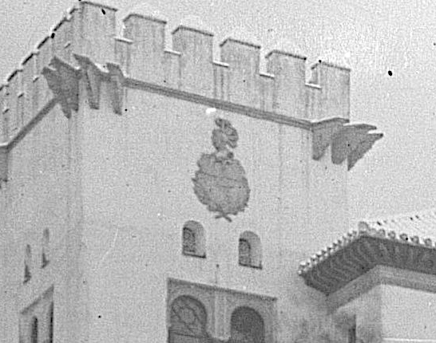

## Introducción

Los comienzos del siglo XX en Granada se caracterizaron, en lo económico, por la gran expansión económica debida sobre todo al cultivo de la caña de azúcar y la implantación de la industria azucarera e infraestructura eléctrica y de transporte relacionada con la misma [@granadaXX] y en lo político por el *lachiquismo* [@osuna2015protesta], caciquismo organizado y dirigido desde Juan Ramón Lachica Mingo, enriquecido precisamente con el cultivo del azúcar y perteneciente (nominalmente) al partido liberal.

En lo primero debemos enmarcar la llegada a Granada de Nicolás de Escoriaza y Fabro [@escoriaza], que en 1903 funda los Tranvías Eléctricos de Granada [@martinez2000gregorio] que comienzan a funcionar el año siguiente. Escoriaza, nombrado vizconde en 1919 (de donde sale el nombre de "Palacio del Vizconde" que también tiene este edificio) tiene negocios con diferentes empresas belgas y suizas, y por ello lo nombran comisario del pabellón español de la exposición universal de Bruselas en 1910.

En lo segundo podemos enmarcar la presencia de Modesto Cendoya [@Cendoya]. Tras ser destituido como arquitecto provincial por su negligencia en la reconstrucción tras el terremoto de Alhama, es nombrado arquitecto conservador de la Alhambra en 1907, posiblemente en el marco del lachiquismo [@lopera1977decision], puesto que ocuparía hasta su cese en 1923. Desde 1901 desarrolló su labor en Granada y a él se deben el Hotel Alhambra Palace y la Azucarera San Isidro. En 1910 se le encargó una copia del patio de los leones para el pabellón de España en la exposición de Bruselas, que comisariaba Nicolás de Escoriaza, posiblemente por él mismo.

Previamente, en 1905, se le había encargado el proyecto de este palacete [@iaph]. Como muchas de las otras obras de Cendoya, sigue el estilo regionalista/historicista, con elementos en este caso nazaríes y mudéjares. La vivienda ha sufrido diferentes reformas, la última de ellas en 1989. Es privada y no se puede visitar; se menciona que son apartamentos turísticos, pero no he encontrado ninguna referencia en ninguna plataforma de ese tipo, así que no podemos saber con exactitud el interior como está decorado ni tomar una foto de detalle desde más cerca. Es un edificio catalogado en el Instituto Andaluz de Patrimonio Histórico como parte de la denominación "Conjunto de palacetes del Paseo de la Bomba" [@iaph], pero no consta ningún tipo de protección.

## Vocabulario arquitectónico

La casa presenta un aspecto general de palacio o vivienda con varios cuerpos, cinco aparentemente desde la vista satélite de Google maps, con jardines alrededor y un torreón almenado en una de las esquinas. La fachada principal se abrehacia la cuesta Escoriaza (nombrada por el propietario inicial del inmueble), y la fachada de entrada real se abre al Paseo de la Bomba con el número 8. Tiene tres pisos, bajo y semisótano, aunque desde esta imagen sólo se pueden apreciar los tres pisos. 

La esquina de la torre, hasta la altura de la tercera planta, está *achaflanada* con una función, una vez más, más estética que defensiva.

### 1: Ménsulas

Se trata de ménsulas exentas, usadas como puro elemento decorativo. En la torre que hay al final de la avenida Cervantes, del mismo arquitecto, se usan de la misma forma. Como bien se indica en [@andaltura], ambos recuerdan a la Torre de los Picos de la Alhambra, tanto en el aspecto general como en el caso de estas ménsulas. En esta última sólo aparecen en uno de los lados, y además es posible que tuvieran una función original de sostén de alguna plataforma defensiva de madera, o quizás un *balcón dionisiano*, *garita* o *ladronera* eliminadas de la Torre de los Picos al perder su función defensiva.

### 2: Almenas

Una vez más, se trata de una copia de la Torre de los Picos, también replicada en la indicada torre de la avenida Cervantes. Tiene merlones terminados en albardilla a cuatro aguas.

### 3. Aleros de madera

Formando quizá parte de un artesonado en el interior, este alero de madera es una vez más similar al de la fachada de Comares; en ese caso pretende dar sombra, en este caso parece puramente decorativa.

### 4: Escudo

El escudo tiene un yelmo, lo que correspondería a algún tipo de hidalguía. Y aunque no está muy claro, presenta una torre centrada. Dado que tras su construcción fue adquirido por la familia Moreno Agrela (también propietaria del palacio de los patos), duques de Agrela, es posible que sea el escudo de la familia Moreno, "una torre de gules en campo de oro, con dos águilas de sable volantes" [@moreno].

Este es uno de los elementos que ha cambiado desde esta foto sin fecha encontrada en Twitter, pero que podría ser de los años 20. Como se ve, el escudo es mucho más historiado, aunque tampoco lleva una corona de vizconde y no se ve con suficiente claridad para afirmar que sea de los Escoriaza.

### 5: Ventanas con celosía

Son ventanas simples en arco de medio punto, pero con unas celosías que recuerdan, en este caso, al Alcázar Genil. Estas ventanas se repiten en la otra parte visible de la torre.

### 6: Columna con capitel nazarí

Esta columna actúa como parteluz del ventanal que veremos a continuación, con el número 7. Usa un capitel nazarí, compuesto por un baquetón, collarín decorado con hojas de palmera y ábaco cuadrado, aparentemente decorado con motivos vegetales. En este caso no tiene basa, y se apoya sobre una balaustrada decorada, aparentemente, con ladrillos exentos y encalados. No hemos encontrado ningún tipo de referencia a este tipo de elemento constructivo, aunque podría ser modernista.

### 7: Ventanal partido con arcos peraltados

Continuamos el muestrario de ventanas, comenzando con estas situadas en el torreón. Se trata de arcos de medio punto peraltados, una vez más muy comunes en el arte nazarí, y presentes en la Alhambra. Aunque no se aprecia con este nivel de ampliación, se trata de arcos *festoneados*, tanto el intradós como la (única) *arquivolta* que hay en el exterior. Aunque no tiene un alfiz marcado en este caso, las *albanegas* están decoradas con motivos vegetales, una vez más igual que en la Alhambra y otros edificios nazaríes o musulmanes.

### 8: 
## Bibliografía
